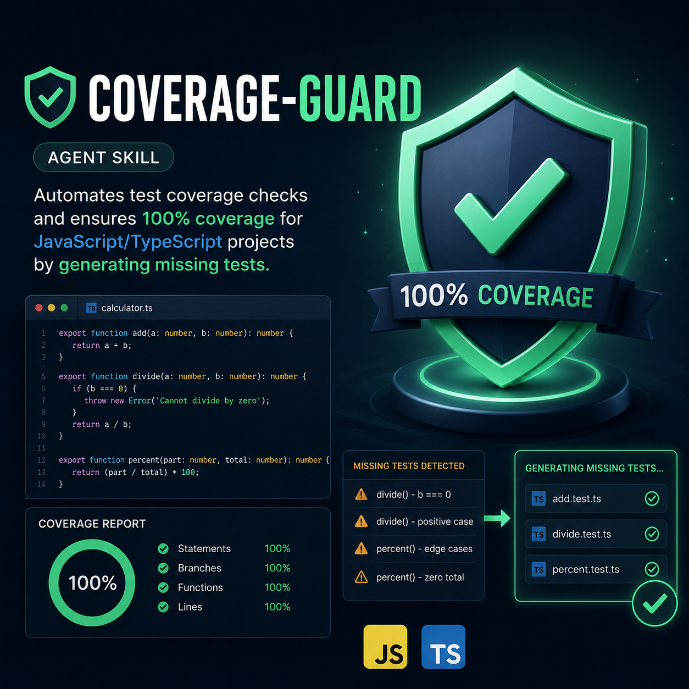

<div align="center">
 

# Coverage Guard

 [](https://awesome.re)
 [](https://github.com/sametcelikbicak/coverage-guard)

 </div>

An AI agent skill that enforces 100% test coverage for any JavaScript/TypeScript project. Works with Vitest, Jest, react-scripts, and other test runners. Compatible with opencode, Claude Code, Cursor, Windsurf, and GitHub Copilot.

## What it does

- **Auto-detects** your test runner (Vitest, Jest, react-scripts, etc.)
- **Scans** all source files and maps them to existing tests
- **Writes tests** for components/modules that have no tests
- **Updates existing tests** to fill coverage gaps
- **Sets up test infrastructure** if missing (interactive setup)
- **Loops** until 100% coverage is achieved

## Install

```bash
# opencode — copy to project
cp -r coverage-guard .opencode/skills/

# or via agentskill.sh
/learn @sametcelikbicak/coverage-guard
```

## Supported runners

- Vitest
- Jest
- react-scripts (CRA)
- Next.js
- Angular (Karma/Jasmine)
- Mocha
- Playwright
- Cypress
- AVA

## License

MIT
